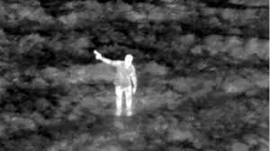
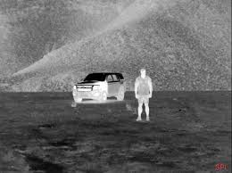
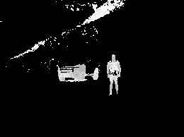
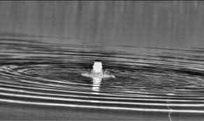
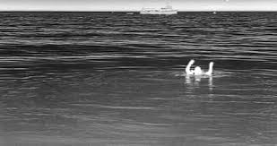

# Infrared Image Processing Pipeline

This project provides a modular, customizable pipeline for processing infrared images with the intent of **helping save lives**. It supports several image enhancement techniques such as normalization, spectral filtering, glare suppression, contrast enhancement, and brightness correction using the inverse square law.

---

## **Features**
- **Modular Steps**: Each step is defined as an independent function for flexibility and reusability.
- **Customizable Pipeline**: Users can specify their own sequence of processing steps.
- **Error Handling**: Handles missing files, invalid configurations, and unexpected inputs gracefully.
- **Support for Batch Processing**: Easily extendable for processing multiple images.

---

## **Example Output**
Here’s an example of an input image and the processed output:

## Land
### Input Image

### Processed Image


## Noisy Land
### Input Image

### Processed Image


## Lake
### Input Image

### Processed Image


## Ocean
### Input Image

### Processed Image


---

## **Requirements**
- Python 3.8+
- **OpenCV**: For advanced image processing.
- **NumPy**: For numerical operations.
- **Matplotlib**: For visualizing the processed results.

Install the required dependencies using:
```bash
pip install -r requirements.txt
```

---

## **How to Use**
1. Place your infrared images in the `images/` directory.
2. Define your custom processing steps in the script.
3. Run the script to process and visualize your images.

### Example Script
```python
if __name__ == "__main__":
    # Provide the path to your infrared image
    image_path = "./images/sample.jpg"

    # Define the custom steps
    custom_steps = [
        step_normalize,
        step_spectral_filter,
        step_polarization_filter,
        step_contrast_enhancement,
        step_inverse_square_brightness
    ]

    try:
        # Process the image with the custom steps
        processed_image = process_infrared_image(image_path, processing_steps=custom_steps)

        # Display the final processed image
        cv2.imshow('Processed Infrared Image', processed_image)
        cv2.waitKey(0)
        cv2.destroyAllWindows()
    except FileNotFoundError as e:
        print(f"Error: {e}")
    except ValueError as e:
        print(f"Invalid step configuration: {e}")
```

---

## **License**
This project is licensed under the **Non-Military and Non-Law Enforcement Use License**, with exceptions for life-saving situations. See the `LICENSE` file for full terms.

---

## **Third-Party Dependencies and Licensing**
This project uses the following libraries, each licensed under permissive open-source terms:
- **OpenCV**: BSD-3-Clause License
- **NumPy**: BSD License
- **Matplotlib**: Matplotlib License (PSF-based)

### Important Note:
These third-party licenses **do not impose restrictions** on usage, including for military or law enforcement purposes. The **Non-Military and Non-Law Enforcement Use License** applies **only to the original code** in this project and may impose additional restrictions. Users are responsible for ensuring compliance with all licenses when using or distributing this software.

---

## **File Structure**
```
├── images/              # Directory for input images
├── output/              # Directory for processed images (optional)
├── main.py              # Main script for processing images
├── utils.py             # Utility and preprocessing functions
├── requirements.txt     # Python dependencies
├── LICENSE              # Custom license file
├── README.md            # Project documentation
```

---

## **Available Processing Steps**
- **`step_normalize`**: Normalizes the image to a range of 0-255.
- **`step_spectral_filter`**: Isolates a specific intensity range and suppresses noise.
- **`step_polarization_filter`**: Reduces glare and smoothens transitions.
- **`step_contrast_enhancement`**: Enhances contrast globally or locally using CLAHE.
- **`step_inverse_square_brightness`**: Suppresses the background while emphasizing bright regions.
- **`step_subtract_background`**: Removes a background reference using Gaussian blur.

---

## **Contribution**
We welcome contributions! You can help by:
- Adding new processing steps.
- Improving existing utilities.
- Reporting issues or suggesting features.

---

## **Disclaimer**
While this project was created with the intent of helping save lives, the authors make no guarantees regarding its performance or suitability for any specific purpose. Users are encouraged to use the software responsibly and ethically, in compliance with the included license and applicable laws.
